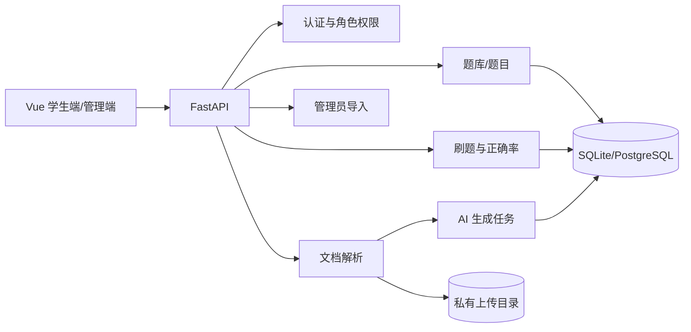

# 题炼系统设计说明书（SDD）

> 版本：MVP 1.0

## 1. 架构

前端使用 Vue 3、Element Plus、Vue Router 与 Axios；后端使用 FastAPI、SQLAlchemy 与 Pydantic；开发环境支持 SQLite，生产可使用 PostgreSQL。PDF 由 pypdf 提取文本，DOCX 由 python-docx 提取文本，AI 使用 OpenAI 兼容接口。

## 2. 数据模型

- `users`：账户、密码哈希、`student|admin` 角色。
- `question_banks`：名称、说明、`platform|document` 来源、`draft|ready` 状态、可空所有者。
- `questions`：`single|multiple`、题干、四个选项、答案、解析、难度、来源。
- `quiz_sessions`：用户一次练习的题库、顺序、进度和结果。
- `quiz_items`：会话题目、用户答案、正确性、提交时间，是题目正确率的统计样本。
- `source_documents`：文件元数据、所有者、私有存储名和提取文本。
- `generation_jobs`：生成配置、状态、错误、草稿题和确认后的题库。
- `knowledge_points`：仅保留旧数据兼容，不参与新业务。

## 3. 权限

| 资源 | 学生 | 所有者学生 | 管理员 |
| --- | --- | --- | --- |
| 平台题库 | 读取/刷题 | — | 读取/维护/导入 |
| 个人题库 | 不可读取他人数据 | 读取/维护/刷题 | 可审计读取 |
| 源文档/生成任务 | 不可读取他人数据 | 创建/读取/维护 | 不默认开放正文 |
| 管理导入 | 禁止 | 禁止 | 校验/导入 |

## 4. API

- 认证：`POST /api/auth/register`、`POST /api/auth/login`、`GET /api/auth/profile`
- 题库：`GET /api/banks?scope=platform|mine`、`GET/PATCH/DELETE /api/banks/{id}`
- 题目：`GET /api/banks/{id}/questions`、`POST /api/questions`、`PATCH/DELETE /api/questions/{id}`
- 文档：`POST /api/documents`
- 生成：`POST /api/generation-jobs`、`GET /api/generation-jobs/{id}`、草稿题编辑/删除、确认、重试
- 刷题：`POST /api/quiz/start`、`GET /api/quiz/next/{id}`、`POST /api/quiz/submit`、`GET /api/quiz/result/{id}`
- 管理：`POST /api/admin/bank-imports/validate`、`POST /api/admin/bank-imports`

## 5. 生成任务

状态流为 `pending → processing → ready → confirmed`，异常进入 `failed`。失败任务可重试；只有 `ready` 草稿可以编辑和确认。确认动作在一个事务内创建题库和题目。

MVP 使用 FastAPI BackgroundTasks，适合单实例。多实例部署时应将任务执行迁移至独立队列。

## 6. 正确率统计

提交成功后以 `quiz_items` 聚合：个人统计通过会话用户过滤，全网统计聚合所有有效提交。统计包含当前提交，后端返回 `correct`、`attempts` 和保留两位小数的 `rate`。唯一索引阻止同一会话同题产生重复样本。

## 7. 文件与 AI 安全

- 扩展名白名单与实际解析结果双重校验；最大 10 MB。
- 服务端生成随机文件名，文件不放入前端静态目录。
- AI 只接收提取文本与出题配置；Prompt 限定材料范围。
- AI JSON 经 Pydantic 校验题型、题量、四选项、答案和解析。
- 前端不把 AI 内容作为 HTML 直接插入页面。

## 8. 配置

关键环境变量：`DATABASE_URL`、`SECRET_KEY`、`CORS_ORIGINS`、`UPLOAD_DIR`、`LLM_API_URL`、`LLM_API_KEY`、`LLM_MODEL`。管理员通过受信任的服务器脚本提升，不开放客户端自助设置角色。

## 9. 验证

后端覆盖认证权限、文件解析、题目校验、管理员事务导入、刷题判分、重复提交和正确率统计。前端执行生产构建，并通过浏览器验证登录、平台题库刷题、文档生成失败/成功状态和管理员入口。
