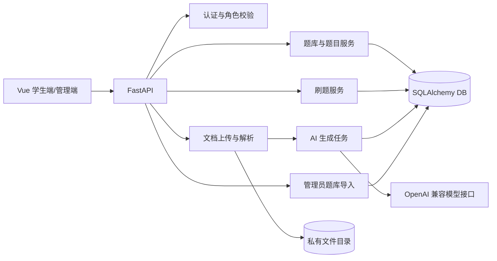

# 题炼产品重构系统设计

## 1. 设计目标

在保留现有 Vue 3、FastAPI、SQLAlchemy 和刷题会话实现的基础上，移除“知识点解释优先”的产品路径，建立两条明确流程：学生使用平台题库直接刷题；学生上传文档生成并确认个人题库。管理员通过标准 JSON 文件维护平台题库。

## 2. UI 设计规格

```text
DESIGN SPECIFICATION
====================
1. Purpose Statement: 面向学生提供高频、低干扰的题库选择与刷题界面。AI 文档生成是基础题库没有目标内容时的补充入口，不占据首页主视觉中心。
2. Aesthetic Direction: Editorial/magazine（校园讲义与练习册风格）
3. Color Palette: 纸张白 #F8F5EC、墨黑 #20251F、教学绿 #18785B、批注橙 #E96B35、分隔灰 #D8D5CB
4. Typography: 中文使用 Noto Serif SC 作为标题、Noto Sans SC 作为正文；代码与题号使用 JetBrains Mono。字体加载失败时回退为通用 serif/sans-serif 字族，不指定受限系统字体名称。
5. Layout Strategy: 桌面端采用左侧窄导航与右侧内容版面；首页以不对称题库列表为主，文档生成入口作为右侧窄栏；刷题页使用题号轨道与题面错位布局。移动端折叠为顶部导航和单列内容。
```

现有紫色渐变品牌样式不再沿用，因为产品已正式更名且用户群与核心流程发生变化。继续使用 Element Plus 图标，不使用 Emoji 充当功能图标。

## 3. 页面与导航

最多保留四个主页面：

1. **首页/题库**：默认展示平台题库和“我的题库”两个分区；支持查看题量、题型并开始刷题；右侧提供“文档生成题库”次级入口。
2. **文档生成**：上传文件 → 配置题库名称、单选/多选数量、难度 → 查看任务状态 → 预览编辑 → 确认题库。
3. **刷题**：选择顺序/随机模式；逐题提交；提交后展示结果、解析、个人历史正确率与全网正确率；完成后展示本次统计。
4. **管理端**：仅管理员可访问，上传标准 JSON 文件并查看全量校验结果；确认后以单事务导入平台题库。

删除“知识点解释”和“输入知识点 AI 出题”导航。个人题库编辑通过首页题库详情抽屉完成，不单独增加主导航。

## 4. 后端模块



### 4.1 文档处理

- 上传使用 `multipart/form-data`，服务端按扩展名和实际解析结果双重校验，限制 10 MB。
- PDF 使用 `pypdf` 提取文本，DOCX 使用 `python-docx`，TXT/Markdown 使用 UTF-8 解码。
- 文档保存为随机文件名，原始名称仅作为元数据；文件不通过静态目录公开。
- 空文本、扫描版 PDF 或解析失败返回明确错误，不调用 AI。
- MVP 使用 FastAPI 后台任务执行生成，前端轮询任务状态；该方案适用于单实例 MVP。多实例部署再引入独立队列，不在本次范围。

### 4.2 AI 生成

- AI 输入只包含解析后的文档文本、题型数量和难度。
- Prompt 明确禁止使用材料外事实，并要求输出 JSON。
- 仅接受 `single`、`multiple`；总数最多 20。
- Pydantic 校验题干、四个不重复选项、选项标签、答案合法性和解析。
- 未配置真实模型时接口返回“AI 服务未配置”，不再用占位题冒充生成结果。
- AI 结果保存在草稿任务中；学生确认时才在事务中创建个人题库与正式题目。

### 4.3 管理员导入

- MVP 使用 UTF-8 JSON 文件，结构为一个题库对象及其 `questions` 数组。
- 导入采用先全量解析校验、后单事务落库；任一题错误则整体回滚。
- 首次部署通过配置的管理员用户名授予 `admin` 角色，普通用户角色为 `student`。

## 5. 数据模型

### 5.1 调整现有表

- `users`：增加 `role`，取值 `student|admin`。
- `question_banks`：移除公开共享语义，增加 `source_type`（`platform|document`）、`status`（`draft|ready`）；平台题库 `owner_id` 可空，个人题库必须有所有者。
- `questions`：题型限定为 `single|multiple`；移除 `knowledge_point_id` 依赖；增加 `source_type`（`import|ai|manual`）。
- `quiz_sessions`、`quiz_items`：保留；`quiz_items` 中每条已提交记录作为正确率统计样本。提交接口增加重复提交保护，并校验题目属于当前会话。

### 5.2 新增表

- `source_documents`：所有者、原始文件名、存储文件名、类型、大小、解析状态、提取文本、创建时间。
- `generation_jobs`：所有者、文档、题库名称、题型数量、难度、状态、错误码、草稿题目 JSON、创建/完成时间。

不保留 `knowledge_points` 业务依赖。为兼容现有 SQLite 演示库，使用 Alembic 迁移新结构，不直接删除用户数据库文件。

## 6. API 设计

### 6.1 学生题库

- `GET /api/banks?scope=platform|mine`
- `GET /api/banks/{id}`
- `GET /api/banks/{id}/questions`
- `PATCH /api/banks/{id}`（仅个人题库所有者）
- `DELETE /api/banks/{id}`（仅个人题库所有者）
- `PATCH /api/questions/{id}`（仅个人题库所有者）
- `DELETE /api/questions/{id}`（仅个人题库所有者）

### 6.2 文档生成

- `POST /api/documents`：上传并解析文档。
- `POST /api/generation-jobs`：创建生成任务。
- `GET /api/generation-jobs/{id}`：查询状态与草稿题目。
- `PATCH /api/generation-jobs/{id}/questions/{index}`：编辑草稿题。
- `DELETE /api/generation-jobs/{id}/questions/{index}`：删除草稿题。
- `POST /api/generation-jobs/{id}/confirm`：确认并创建个人题库。
- `POST /api/generation-jobs/{id}/retry`：仅失败任务可重试。

### 6.3 管理员

- `POST /api/admin/bank-imports/validate`：解析并返回校验结果，不写库。
- `POST /api/admin/bank-imports`：重新校验并导入平台题库。

所有资源接口使用当前登录用户身份，不允许写死用户 ID。

### 6.4 答题统计响应

`POST /api/quiz/submit` 在原有判题结果之外返回：

```json
{
  "personal_accuracy": { "correct": 2, "attempts": 3, "rate": 66.67 },
  "global_accuracy": { "correct": 72, "attempts": 100, "rate": 72.0 }
}
```

- 两组统计均包含刚刚提交成功的本次作答。
- 统计单位为有效的 `quiz_items` 提交记录；同一会话同一题只有一条有效记录。
- 个人统计过滤当前 `user_id`，全网统计不区分用户。
- 正确率在后端计算并保留两位小数，前端不自行推导。
- 为 `quiz_items(question_id, submitted_at)` 及关联会话用户查询建立索引。MVP 直接聚合计算；数据规模增长后再引入汇总表，不提前增加缓存一致性复杂度。

## 7. 权限与安全

- 学生可读取平台题库和自己的个人题库；不得读取他人的个人题库及源文档。
- 只有管理员可导入、修改或删除平台题库。
- 下载源文档不作为 MVP 功能开放。
- 文件存储路径由服务端生成，禁止使用用户文件名拼接路径。
- Markdown 展示必须净化 HTML，避免 AI 内容或题目内容产生 XSS。
- CORS 改为配置允许来源；启用凭据时不使用 `*`。

## 8. 错误与状态

生成任务状态：`pending → processing → ready → confirmed`，失败进入 `failed`；只有 `failed` 可重试，只有 `ready` 可编辑和确认。

错误至少区分：文件类型不支持、文件过大、文档无可提取文本、AI 未配置、AI 超时、AI 输出不合法、无权限和资源不存在。

## 9. 验证策略

- 后端单元测试：文件限制、四类文档解析、题目 Schema、权限隔离、多选集合判分、重复提交、个人与全网正确率、事务回滚。
- API 集成测试：学生浏览平台题库、文档生成任务生命周期、个人题库确认、管理员导入。
- 前端构建检查：`npm run build`。
- 浏览器流程：登录 → 平台题库刷题并查看题目正确率；上传文档 → 生成 → 编辑 → 确认 → 刷题；管理员导入合法/非法文件。
- 回归检查：注册登录和现有刷题结果接口继续可用。

## 10. 迁移与兼容

- 页面和品牌统一由“题炼 AIQuiz.ai”改为“题炼”。
- 删除前端 `/knowledge` 与旧 `/questions` 入口，并将旧地址重定向到文档生成页。
- 旧知识点数据保留在数据库中但不再展示；确认迁移稳定后再单独安排清理。
- 现有简答题不进入新刷题题库列表，避免新流程出现无法判分题型。
